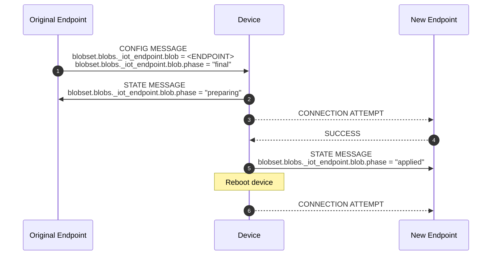
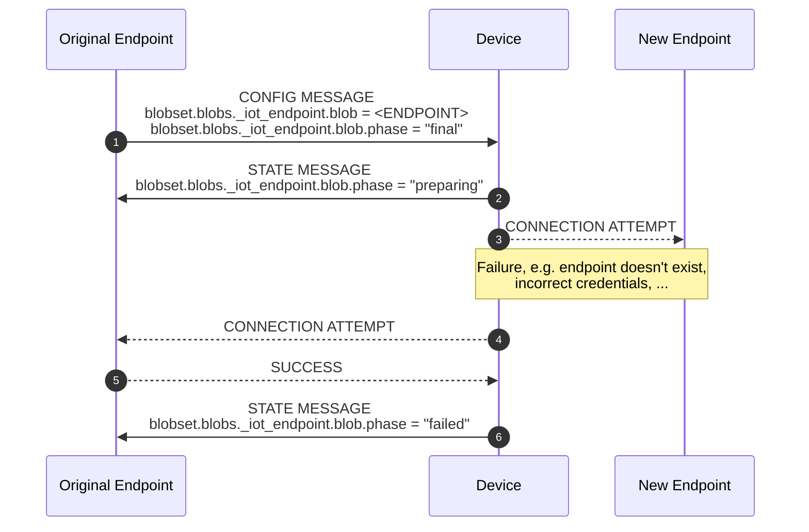

```mermaid
%%{wrap}%%
sequenceDiagram
    autonumber
    participant E as Original Endpoint
    participant D as Device
    participant E' as New Endpoint
    E->>D:CONFIG MESSAGE<br>blobset.blobs._iot_endpoint.blob = <ENDPOINT><br>blobset.blobs._iot_endpoint.blob.phase = "final"
    D->>E:STATE MESSAGE<BR>blobset.blobs._iot_endpoint.blob.phase = "preparing"
    D-->>E':CONNECTION ATTEMPT
    E'-->>D:SUCCESS
    D->>E':STATE MESSAGE<BR>blobset.blobs._iot_endpoint.blob.phase = "applied"
    note over D: Reboot device
    D-->>E':CONNECTION ATTEMPT
```

### Invalid Endpoint (Unsuccessful Reconfiguration)

```mermaid
%%{wrap}%%
sequenceDiagram
    autonumber
    participant E as Original Endpoint
    participant D as Device
    participant E' as New Endpoint
    E->>D:CONFIG MESSAGE<br>blobset.blobs._iot_endpoint.blob = <ENDPOINT><br>blobset.blobs._iot_endpoint.blob.phase = "final"
    D->>E:STATE MESSAGE<BR>blobset.blobs._iot_endpoint.blob.phase = "preparing"
    D-->>E':CONNECTION ATTEMPT
    note over D,E': Failure, e.g. endpoint doesn't exist, incorrect credentials, ...
    D-->>E:CONNECTION ATTEMPT
    E-->>D:SUCCESS
    D->>E:STATE MESSAGE<BR>blobset.blobs._iot_endpoint.blob.phase = "failed"
```
